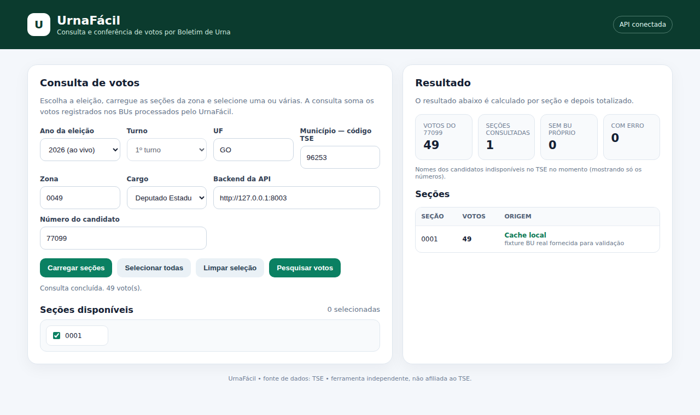

# UrnaFácil

Consulta e soma de votos **seção por seção**, direto dos **Boletins de Urna oficiais do TSE**.

No site do TSE você vê o resultado de uma urna por vez. O UrnaFácil baixa os boletins de várias seções de uma vez, decodifica cada um e mostra quantos votos cada candidato teve em cada urna, com o total, o ranking e a planilha para o Excel.



> Conferência: na zona 0049 de Trindade (GO), somando as 312 seções, o total de um candidato a Deputado Estadual em 2026 bateu exatamente com o site oficial do TSE (17.853 votos).

## O que ele faz

- **Eleição de 2026 ao vivo**: baixa o Boletim de Urna (BU) de cada seção do site de resultados do TSE e decodifica o arquivo binário oficial.
- **Eleições anteriores (2018, 2020, 2022, 2024)**: importa o arquivo de votação por seção dos **Dados Abertos do TSE**.
- **Várias seções de uma vez**: carrega todas as seções da zona; você marca as que quer (ou todas) e o sistema soma.
- **Ranking completo**: com o número do candidato vazio, mostra todos os candidatos, do mais ao menos votado, com uma coluna por seção e os nomes.
- **Planilha**: exporta o resultado em CSV, que abre direto no Excel.
- **Seções agregadas**: seções que não têm urna própria aparecem como aviso, não como erro (os votos delas estão no BU da seção principal).
- **Cache local (SQLite)**: cada boletim é baixado uma vez só; as consultas seguintes são instantâneas.

## Como abrir (Windows)

1. Baixe o projeto (**Code → Download ZIP**) e descompacte.
2. Dê **dois cliques** em `Iniciar UrnaFacil.bat`.
3. O navegador abre sozinho em http://127.0.0.1:8000.

Na primeira vez ele instala as dependências (precisa de internet e do [Python](https://www.python.org/downloads/) instalado). Para encerrar, feche a janela preta do UrnaFácil.

## Como funciona

```
Tela (HTML + JS)  →  API (FastAPI)  →  TSE
                         │              ├─ 2026: Boletins de Urna (resultados.tse.jus.br)
                         │              └─ anos anteriores: Dados Abertos (votacao_secao_ANO_UF.zip)
                         └─ cache SQLite
```

**2026 (Boletim de Urna)**
1. Lê a configuração oficial do estado (`cs.json`) para listar as seções da zona.
2. Para cada seção, lê o índice da urna (`aux.json`), que diz onde está o arquivo do boletim.
3. Baixa o BU (`...-bu.dat`) e decodifica o formato binário **ASN.1/BER** definido pelo TSE.
4. Separa os votos nominais do cargo escolhido e guarda tudo no SQLite.

**Anos anteriores (Dados Abertos)**
1. Na primeira consulta, baixa o arquivo do estado (grande, com barra de progresso).
2. Importa para o SQLite só o município escolhido. O arquivo fica guardado para outros municípios do mesmo estado.

Brancos, nulos e votos de legenda ficam fora do ranking nas duas fontes.

## Tecnologias

- **Python 3** + **FastAPI** (API) + **Uvicorn** (servidor)
- **SQLite** (cache)
- **HTML, CSS e JavaScript** puros (sem framework)
- **pytest** (testes automatizados)

## Estrutura

```
backend/
  main.py            API: rotas e regras da pesquisa
  tse_client.py      download dos arquivos do TSE (configuração, índice e BU)
  bu_decoder.py      decodificador do Boletim de Urna (ASN.1/BER)
  candidatos.py      nomes dos candidatos (2026)
  dados_abertos.py   eleições anteriores (Dados Abertos do TSE)
  cache.py           banco SQLite
  iniciar.py         liga o servidor e abre o navegador
  tests/             testes automatizados
frontend/index.html  a tela
Iniciar UrnaFacil.bat
```

## API

| Rota | O que faz |
|---|---|
| `GET /secoes/{uf}/{municipio}/{zona}` | seções da zona (2026) |
| `GET /pesquisa-multiplas?secoes=0001,0002&cargo=7&candidato=77099` | soma os votos nas seções; sem `candidato`, devolve o ranking completo |
| `GET /anos` | eleições disponíveis e cargos de cada uma |
| `POST /historico/importar?ano=2024&uf=go&municipio=96253` | importa um ano anterior |
| `GET /candidatos/{uf}/{municipio}?cargo=7` | nomes dos candidatos (2026) |

Com o sistema aberto, a documentação interativa completa fica em http://127.0.0.1:8000/docs.

## Testes

```bash
cd backend
pip install -r requirements-dev.txt
pytest -q
```

Os testes usam um Boletim de Urna real de Trindade (zona 0049, seção 0001) em `backend/tests/fixtures/`, além de respostas simuladas do TSE. Eles não acessam a internet.

## Aviso

Ferramenta independente, **não afiliada ao TSE**. Todos os números vêm dos arquivos oficiais publicados pelo TSE; o sistema não inventa nem estima votos. Em caso de divergência, vale o resultado oficial em [resultados.tse.jus.br](https://resultados.tse.jus.br).
